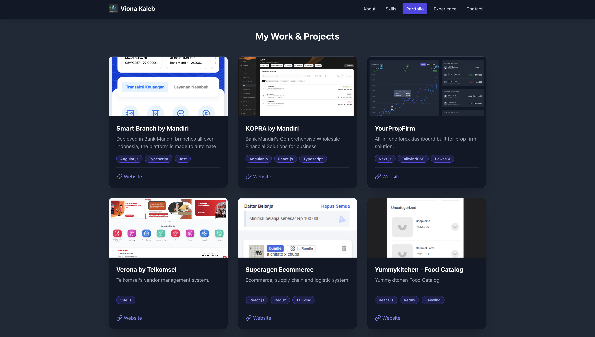

# 🚀 Viona Kaleb | Professional Software Engineer Portfolio



This is a single-page application (SPA) portfolio for Viona Kaleb, a professional Front-End Software Engineer with 5+ years of experience. The site is designed for performance, responsiveness, and clean code architecture using the modern Vite/React/TypeScript stack.

The application dynamically renders content, including career history, technical skills, and a project gallery, all sourced from local JSON data for rapid updates.

## ✨ Key Features

```
⚡️ Highly Performant: Built with Vite for ultra-fast development and optimized production builds.

🌓 Dark Mode Native: Designed with a clean, dark aesthetic using Tailwind CSS.

📱 Fully Responsive: Adaptive layout ensures perfect viewing across all devices (mobile, tablet, desktop).

⚛️ Component-Driven: Clean, separated component architecture using React and TypeScript.

🎯 Global State Management: Utilizes Zustand for simple, fast, and centralized application state.

🖼️ Interactive Gallery: Project images are displayed in a grid and open into a responsive fullscreen viewer using Swiper.js.

🧭 Timeline View: Dynamic rendering of Education and Work Experience in a clean, alternating timeline layout.
```

## 🛠 Tech Stack

```
Framework: React
Language: TypeScript
Bundler: Vite
Styling: Tailwind CSS
State: Zustand
Icons: Lucide React
Interactivity: Swiper.js
```

Used for the modern, touch-friendly project gallery modal.

## 💻 Installation and Local Setup

To get this portfolio running on your local machine:

1. Clone the repository

```
git clone <YOUR_REPOSITORY_URL>
cd portfolio-project
```

2. Install Dependencies

Install all necessary packages, including zustand, lucide-react, and the development tools.

```
npm install
npm install -D gh-pages # Required for deployment
```

3. Run the Development Server

```
npm run dev
```

The application will be available at http://localhost:5173 (or similar).

## ⚙️ Project Structure

The project follows a modular, scalable structure:

```
├── public/
├── src/
│   ├── components/       # UI Components (Navigation, Hero, Portfolio, etc.)
│   ├── data/             # JSON Data Source
│   ├── store/            # Zustand State Store (usePortfolioStore.ts)
│   ├── types/            # TypeScript Interface Definitions (dataTypes.ts)
│   ├── utils/            # Utility Components (ScrollLink.tsx)
│   ├── App.tsx           # Main application wrapper
│   └── main.tsx          # Entry point
├── .gitignore
├── index.html            # Entry HTML (includes SEO and meta tags)
├── package.json
├── tailwind.config.js    # Tailwind configuration
└── vite.config.ts        # Vite configuration (Base path set for GitHub Pages)
```

## 🚀 Deployment to GitHub Pages

The project is pre-configured to deploy effortlessly to GitHub Pages using the gh-pages library.

1. Update vite.config.ts

Ensure the base property in vite.config.ts is set correctly to your repository name:

```
// vite.config.ts
export default defineConfig({
  // **MAKE SURE THIS MATCHES YOUR REPO NAME**
  base: '/<YOUR_REPOSITORY_NAME>/',
  // ...
});
```

2. Deploy Script

Run the following command. The predeploy script automatically runs the optimized production build before pushing.

```
npm run deploy
```

3. Configure GitHub (First Time Only)

Navigate to your GitHub repository Settings > Pages and set the Source branch to gh-pages. Your site will be live shortly!

✅ Code Quality and Performance Notes
React Compiler Enabled

This template utilizes the React Compiler for automatic memoization and performance improvements, ensuring components re-render only when necessary.
Type-Aware ESLint

For maximum code quality, the ESLint configuration is structured to enable advanced type-aware rules (e.g., tseslint.configs.recommendedTypeChecked), requiring the use of the languageOptions.parserOptions.project setting to link to tsconfig.app.json and tsconfig.node.json. This ensures your code is strictly compliant with best practices.
